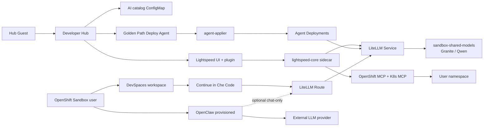

# Architecture

## End-to-end picture




## Components

| Component | How it is delivered | Network |
|---|---|---|
| Red Hat Developer Hub 1.10.3 | Helm subchart `redhat-developer-hub` | Route `*-developer-hub` |
| lightspeed-core | Sidecar on Hub pod (RHDH Lightspeed flavour) | localhost from Hub plugin |
| LiteLLM | Chart Deployment | ClusterIP + **Route** (for DevSpaces) |
| Shared models | Cluster `sandbox-shared-models` InferenceServices | Called by LiteLLM with `model-api-key` |
| OpenShift MCP (Quarkus) | Chart Deployment | ClusterIP `:8080` |
| Kubernetes MCP | Chart Deployment | ClusterIP `:8085` |
| AI catalog | ConfigMap `rhdh-agent-sandbox-catalog` | Mounted at `/opt/app-root/src/catalog` |
| Scaffolder assets | ConfigMap + projected volume | `/opt/app-root/src/scaffolder-assets` |
| Agent samples + applier | Chart Deployments / SA Role | ClusterIP agents → LiteLLM |
| DevSpaces | Operator on Sandbox + Devfiles / templates | User-created DevWorkspace |
| OpenClaw (optional) | Provisioned from sandbox.redhat.com (not this chart) | Managed OpenClaw + your LLM keys |

## Identity and tokens

```text
Hub Guest ──(no token)──► Lightspeed UI
                              │
OpenShift user ──model-api-key──► LiteLLM ──► shared models (oauth-proxy)
OpenShift user ──litellm-master-key──► Continue / LiteLLM Route
Hub backend ──mcp-token──► /api/mcp-actions/v1 (Lightspeed MCP integration)
```

| Secret key | Consumer | Lifetime |
|---|---|---|
| `model-api-key` | LiteLLM → shared models | ~24h (refresh with `oc whoami -t`) |
| `litellm-master-key` | Lightspeed (`VLLM_API_KEY`) + Continue | Stable (chart-generated) |
| `mcp-token` | Lightspeed → RHDH MCP actions | Stable (chart-generated) |
| `backend-secret` | Hub backend auth | Stable |

## Catalog loading

Hub `catalog.locations` uses a **file** location:

```yaml
type: file
target: /opt/app-root/src/catalog/all.yaml
```

The ConfigMap is filled from `files/catalog/*` (skills, prompts, MCP entities, Deploy Agent template, sample agents, users/groups). No GitHub URL location is required for the demo.

## Lightspeed inference path

1. UI / plugin posts to Hub `/api/lightspeed/v1/query`.  
2. Hub proxies to **lightspeed-core** (`streaming_query`).  
3. lightspeed-core uses provider **`vllm`** (`ENABLE_VLLM=true`) with `VLLM_URL` → LiteLLM Service.  
4. Model ids in the UI look like `vllm/granite` / `vllm/qwen3` (llama-stack provider prefix).  
5. LiteLLM forwards to Granite/Qwen. Shared Sandbox models do **not** accept `tool_choice=auto`; the chart disables function-calling params for those aliases.

## MCP path

- **Hub Lightspeed** uses ClusterIP MCP services and RHDH mcp-actions (`mcp-integration-tools` + `MCP_TOKEN`).  
- MCP ServiceAccount has **namespace** Role only (Sandbox-safe).  
- **No public MCP Routes** — DevSpaces talks to LiteLLM Route only, not MCP.

## Quota sketch (NotTerminating)

Typical stack requests leave headroom for one modest DevSpaces workspace. Stop extra workspaces when finished so Hub + LiteLLM stay schedulable.
