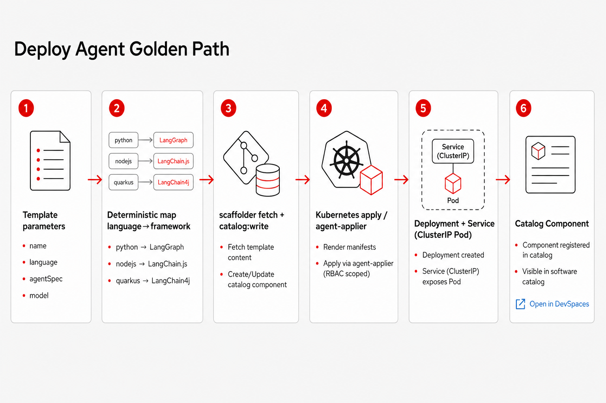

# Golden Paths

Deploy namespace-scoped agents from Developer Hub **without git push**. The primary path is **Deploy Agent**.

## Deploy Agent

| Field | Role |
|---|---|
| `name` | Deployment / Service / Component name |
| `owner` | Catalog owner (Group) |
| `language` | Selects framework (deterministic map) |
| `agentType` | `tool-agent` / `chat-agent` / `rag-agent` |
| `agentSpec` | Stored as `AGENT_SPEC` on the Pod |
| `model` | LiteLLM alias (`granite` or `qwen3`) |

### Framework map (fixed)

| language | default agentType | framework |
|---|---|---|
| python | tool-agent | LangGraph (HTTP stub) |
| nodejs | tool-agent | LangChain.js (HTTP stub) |
| quarkus | tool-agent | LangChain4j (HTTP stub) |

No LLM chooses the framework — the scaffolder logs the map and stamps annotations.

### What you get

1. **Catalog Component** with annotations `rhdh-agent-sandbox.io/managed-agent=true` and an **Open in DevSpaces** factory link.
2. **Deployment + Service (ClusterIP)** created/updated by the chart **agent-applier** from those annotations (poll ~45s). Runtime talks to LiteLLM over Service DNS; no public agent Route.

### Run it (Guest)

1. Hub → **Create** → **Deploy Agent (Golden Path)**.
2. Fill name, language, agentSpec, model → Create.
3. Open the Component → use **Open in DevSpaces**.
4. As OpenShift user: `oc get deploy/<name>` and `oc logs deploy/<name>`.

Skeletons and agent-runtime manifests are mounted at `/opt/app-root/src/scaffolder-assets` (no `publish:github`).

## Sample agents

The chart also ships three sample Components + Deployments: `sample-python-agent`, `sample-nodejs-agent`, `sample-quarkus-agent`. Same Open in DevSpaces links under `files/templates/skeletons/<lang>`.

## Related

- [Agents](agents.md) — Hub / Pod / DevSpaces loops  
- [Quickstart](quickstart.md) — install  
- [Architecture](architecture.md) — end-to-end picture  
