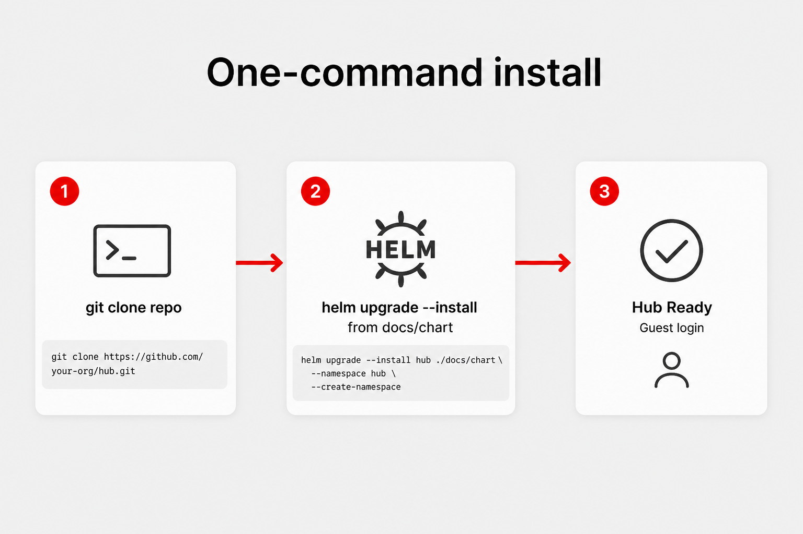

# Agent-friendly Developer Hub on Developer Sandbox

Umbrella Helm chart that deploys **Red Hat Developer Hub 1.10.3** on **OpenShift Developer Sandbox** with a working agent loop: Lightspeed → LiteLLM → shared Granite/Qwen, plus MCP tools, Golden Paths, and DevSpaces AI workspaces.



## What you get

| Piece | Role |
|---|---|
| **Developer Hub** | Guest login, catalog, scaffolder, TechDocs, Lightspeed UI |
| **LiteLLM** | OpenAI-compatible gateway to `sandbox-shared-models` (Granite / Qwen) |
| **MCP servers** | OpenShift + Kubernetes tools (namespace-scoped) for Lightspeed |
| **Golden Paths** | Deploy Agent → Pod + Component + Open in DevSpaces (no git push) |
| **AI catalog** | Skills, prompts, MCP entities, software templates (ConfigMap mount) |
| **DevSpaces AI** | Browser IDE (Che Code + Continue) talking to the LiteLLM Route |
| **OpenClaw** (optional) | Personal assistant from sandbox.redhat.com; bring your own LLM keys |

## Two identities (important)

| Who | What they do |
|---|---|
| **Hub Guest** | Signs into Developer Hub only. Uses Lightspeed + catalog. No OpenShift token. |
| **OpenShift Sandbox user** (`oc` / console) | Refreshes `model-api-key`, starts DevSpaces workspaces, reads `litellm-master-key`. |

Guest Hub ≠ DevSpaces login. The chart prepares Devfiles and IDE config; the Sandbox user opens the workspace.

## Recommended path

1. [Quickstart](quickstart.md) — single `helm upgrade --install`  
2. [Golden Paths](golden-paths.md) — deploy an agent Pod  
3. [Verify the install](verify.md) — confirm Hub, LiteLLM, agents  
4. [Demo script](demo-script.md) — ~10 minute walkthrough  
5. [Agents](agents.md) / [DevSpaces AI](devspaces-ai.md)  

Deeper reading: [Architecture](architecture.md), [Lightspeed & models](lightspeed-models.md), [Troubleshooting](troubleshooting.md).

## Install

Chart source is at the **repo root**. Red Hat Developer Hub is a Helm dependency (`redhat-developer-hub` from `https://charts.openshift.io/`). Pages serves `/docs`, which includes `index.yaml`, `artifacthub-repo.yml`, and the packaged `.tgz`.

```bash
git clone https://github.com/maximilianoPizarro/rhdh-agent-sandbox.git
cd rhdh-agent-sandbox

helm dependency update
helm upgrade --install rhdh-agent . \
  --namespace "$(oc project -q)" \
  --set secrets.modelApiKey="$(oc whoami -t)" \
  --set rhdh.global.clusterRouterBase=apps.<your-sandbox>.openshiftapps.com \
  --timeout 20m \
  --wait=false
```

Or from the Pages Helm repo:

```bash
helm repo add rhdh-agent-sandbox https://maximilianopizarro.github.io/rhdh-agent-sandbox
helm upgrade --install rhdh-agent rhdh-agent-sandbox/rhdh-agent-sandbox \
  --namespace "$(oc project -q)" \
  --set secrets.modelApiKey="$(oc whoami -t)" \
  --set rhdh.global.clusterRouterBase=apps.<your-sandbox>.openshiftapps.com \
  --timeout 20m \
  --wait=false
```

If `ingresses.config.openshift.io` is Forbidden, infer the apps domain from any Route host (`oc get route` → drop the first DNS label).

## Source

[github.com/maximilianoPizarro/rhdh-agent-sandbox](https://github.com/maximilianoPizarro/rhdh-agent-sandbox)
