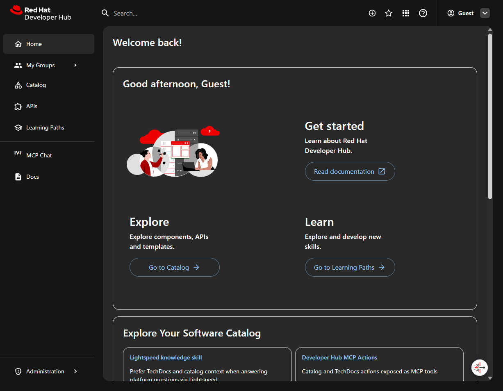
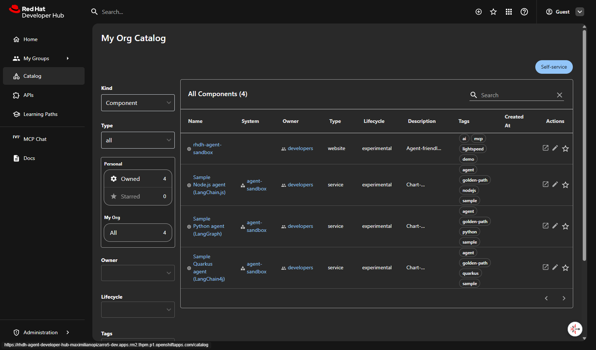
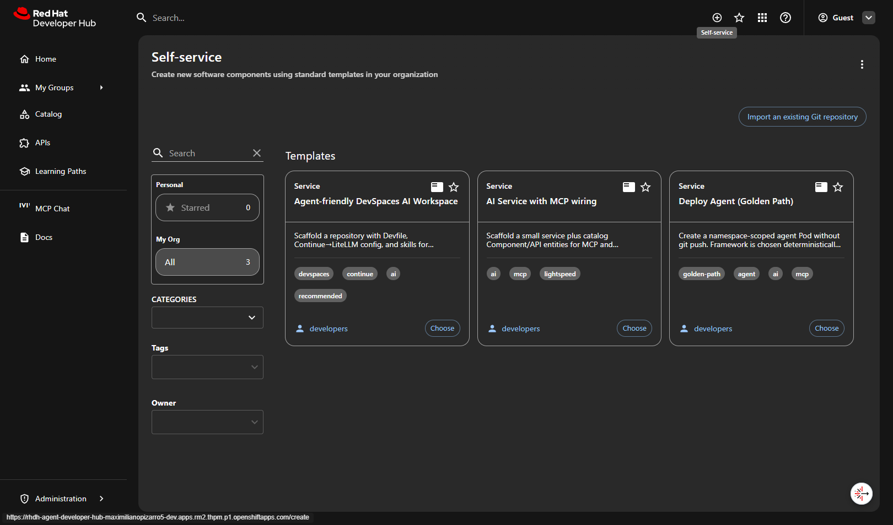
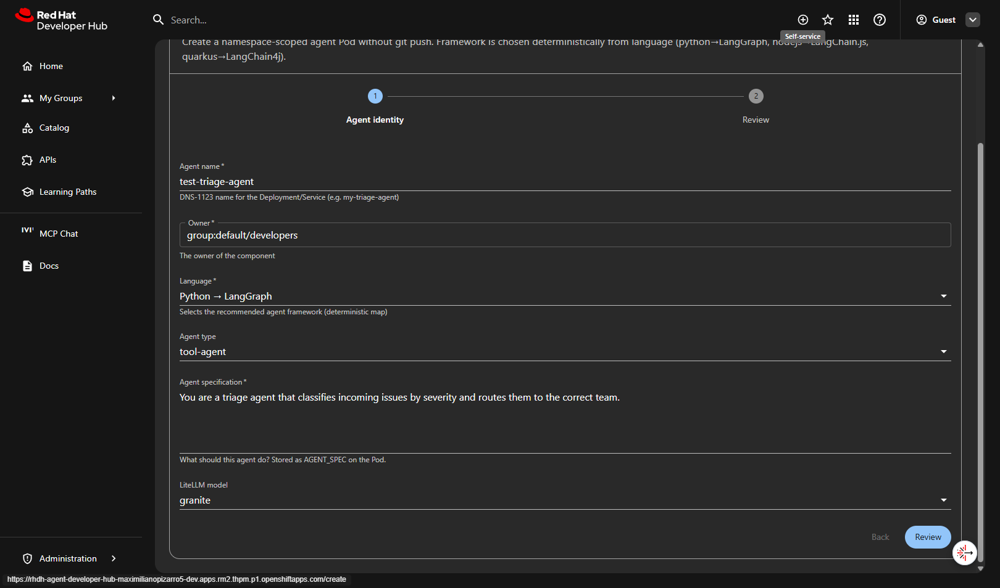
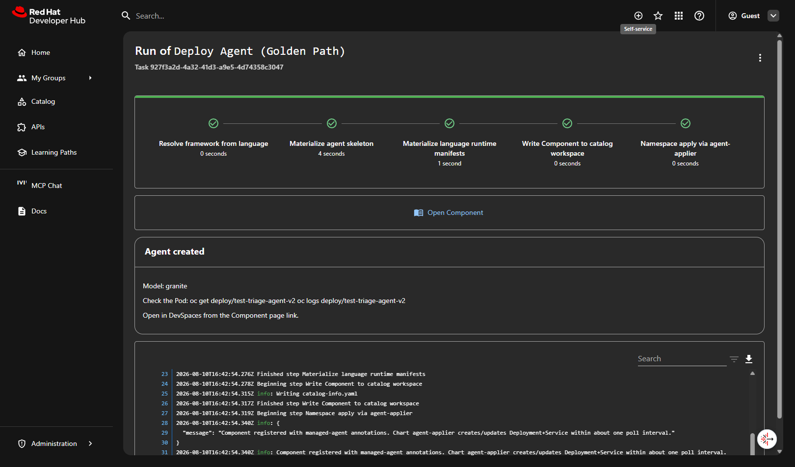

# Golden Path journey

<p class="muted">End-to-end walkthrough: from Developer Hub home to a running agent Pod — no git push required. Expect ~5 minutes.</p>

<div class="journey-carousel" id="journey-carousel" role="region" aria-roledescription="carousel" aria-label="Golden Path journey" tabindex="0">
<div class="journey-viewport" id="journey-viewport">

<figure class="journey-slide is-active" data-slide="0" role="group" aria-roledescription="slide" aria-label="1 of 5">

<figcaption>
<span class="slide-num">Step 01</span>
<strong>Developer Hub</strong>
<span class="desc">Login as Guest and land on the home page. Explore, Learn, and Self-service cards are ready.</span>
</figcaption>
</figure>

<figure class="journey-slide" data-slide="1" role="group" aria-roledescription="slide" aria-label="2 of 5" hidden>

<figcaption>
<span class="slide-num">Step 02</span>
<strong>Software Catalog</strong>
<span class="desc">4 Components: the sandbox itself plus 3 sample agents (Python, Node.js, Quarkus) with golden-path and agent tags.</span>
</figcaption>
</figure>

<figure class="journey-slide" data-slide="2" role="group" aria-roledescription="slide" aria-label="3 of 5" hidden>

<figcaption>
<span class="slide-num">Step 03</span>
<strong>Self-service Templates</strong>
<span class="desc">Three templates: DevSpaces AI Workspace, AI Service with MCP, and Deploy Agent (Golden Path).</span>
</figcaption>
</figure>

<figure class="journey-slide" data-slide="3" role="group" aria-roledescription="slide" aria-label="4 of 5" hidden>

<figcaption>
<span class="slide-num">Step 04</span>
<strong>Deploy Agent form</strong>
<span class="desc">Fill agent name, owner, language (Python → LangGraph), agent spec, and model. Framework is resolved deterministically.</span>
</figcaption>
</figure>

<figure class="journey-slide" data-slide="4" role="group" aria-roledescription="slide" aria-label="5 of 5" hidden>

<figcaption>
<span class="slide-num">Step 05</span>
<strong>Agent deployed</strong>
<span class="desc">All steps green: skeleton materialized, runtime manifests applied, Component registered. The agent-applier creates the Deployment + Service within one poll interval.</span>
</figcaption>
</figure>

</div>
<div class="journey-controls">
<div class="journey-nav">
<button type="button" class="journey-btn" id="journey-prev" aria-label="Previous slide">← Prev</button>
<button type="button" class="journey-btn" id="journey-next" aria-label="Next slide">Next →</button>
<button type="button" class="journey-btn" id="journey-fs" aria-label="Toggle fullscreen" aria-pressed="false">Fullscreen</button>
</div>
<div class="journey-dots" id="journey-dots" role="tablist" aria-label="Slide picker"></div>
<span class="journey-status" id="journey-status" aria-live="polite">1 / 5</span>
</div>
</div>

## What happens behind the scenes

1. **Resolve framework** — `python` → LangGraph, `nodejs` → LangChain.js, `quarkus` → LangChain4j
2. **Materialize skeleton** — `fetch:template` from GitHub sources
3. **Materialize runtime** — language-specific Deployment + Service manifests
4. **Write Component** — `catalog:write` registers the entity directly in the Hub catalog
5. **Agent-applier** — watches for `managed-agent` annotations and creates/updates K8s resources

## Verify the agent

```bash
oc get deploy/test-triage-agent-v2
oc logs deploy/test-triage-agent-v2
curl -s http://test-triage-agent-v2:8080/health | jq .
```
