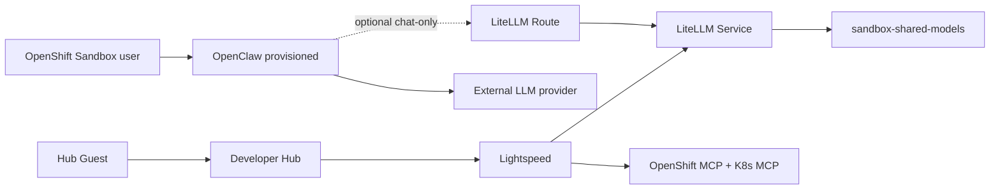

# OpenClaw (optional)

OpenClaw is a **personal AI assistant** you provision from [sandbox.redhat.com](https://sandbox.redhat.com) — not from this Helm chart. It runs in your Developer Sandbox namespace with a managed lifecycle.

This page explains how OpenClaw relates to the RHDH agent stack and how to wire it safely.

## Role in the architecture

OpenClaw is a **third AI client**, alongside Hub Lightspeed and DevSpaces Continue. It does **not** replace the chart’s MCP servers.

| Client | How you get it | Typical model path |
|---|---|---|
| Lightspeed | Chart (Hub sidecar) | LiteLLM → shared Granite/Qwen |
| Continue (DevSpaces AI) | Chart Devfiles + Sandbox DevSpaces | LiteLLM Route + `litellm-master-key` |
| **OpenClaw** | Provision on sandbox.redhat.com | **Your own** Anthropic / OpenAI / Google key |



## Prerequisites

| Requirement | Notes |
|---|---|
| OpenClaw provisioned | Card on sandbox.redhat.com → **Provision** |
| External LLM API key | Anthropic, OpenAI, Google, etc. (required for agentic tools) |
| This chart installed | Optional for OpenClaw itself; needed only if you also want LiteLLM chat fallback |
| Quota headroom | OpenClaw adds its own Deployment + PVC; stop unused DevSpaces workspaces first |

## Recommended path: external API key (full agentic)

Shared Sandbox models (Granite / Qwen) **do not** support function calling (`tool_choice=auto`). This chart drops those params in LiteLLM so Lightspeed does not crash. OpenClaw’s agent loop needs tool calls (`exec`, `read`, `write`, …), so **bring your own provider key**.

Configure OpenClaw (Control UI or `~/.openclaw/openclaw.json`) with your provider, for example:

```json5
{
  agents: {
    defaults: {
      model: { primary: "anthropic/claude-sonnet-4-5" },
      // Developer Sandbox has no Docker daemon for tool sandboxes
      sandbox: { mode: "off" },
    },
  },
  // Prefer env / SecretRef for the real key — do not commit keys to git
  env: {
    ANTHROPIC_API_KEY: "sk-ant-...",
  },
}
```

Use OpenClaw’s onboard / Control UI **Config** tab if you prefer a form over raw JSON5. Follow [OpenClaw configuration](https://docs.openclaw.ai/) for the exact provider fields for your vendor.

> **Tip: Sandbox tool sandboxing**
>
> OpenClaw can sandbox tools with Docker (`agents.defaults.sandbox.mode: non-main|all`). Developer Sandbox does **not** expose a Docker socket or privileged DinD. Keep `sandbox.mode: "off"` so tools run inside the OpenClaw pod under the provisioned ServiceAccount.

## Optional: LiteLLM as chat-only custom provider

You can point OpenClaw at this chart’s LiteLLM Route for **chat without tools** (same Granite/Qwen aliases as Continue).

1. Get the Route and master key:

```bash
export NAMESPACE=$(oc project -q)
oc get route -n "${NAMESPACE}" | grep litellm
export LITELLM_KEY=$(oc get secret rhdh-agent-sandbox-secrets -n "${NAMESPACE}" \
  -o jsonpath='{.data.litellm-master-key}' | base64 -d)
```

2. Example custom provider (adjust host to your Route):

```json5
{
  models: {
    mode: "merge",
    providers: {
      "sandbox-litellm": {
        baseUrl: "https://rhdh-agent-sandbox-litellm-<namespace>.apps.<cluster>/v1",
        apiKey: "${LITELLM_MASTER_KEY}",
        api: "openai-completions",
        models: [
          { id: "granite", name: "Granite (Sandbox)", reasoning: false, input: ["text"] },
          { id: "qwen3", name: "Qwen3 (Sandbox)", reasoning: false, input: ["text"] },
        ],
      },
    },
  },
  agents: {
    defaults: {
      model: { primary: "sandbox-litellm/granite" },
      sandbox: { mode: "off" },
    },
  },
}
```

> **Warning: Chat-only with shared models**
>
> With Granite/Qwen via LiteLLM, OpenClaw will **not** get reliable tool calls. Use this path only for plain Q&A. For agentic work (code, shell, multi-step tools), use an external API key.

## What this chart does *not* do

- Does **not** deploy OpenClaw (no `openclaw:` block in `values.yaml`).
- Does **not** create OpenClaw Secrets or Routes.
- Does **not** expose public MCP Routes — Lightspeed still uses ClusterIP MCP only. OpenClaw on Sandbox should not require opening MCP to the internet.

## Identity reminder

| Identity | OpenClaw |
|---|---|
| Hub Guest | No access to OpenClaw provisioning or cluster secrets |
| OpenShift Sandbox user | Provisions OpenClaw, supplies LLM keys, may read `litellm-master-key` for chat-only wiring |

## See also

- [Architecture]({{ '/architecture/' | relative_url }}) — full stack diagram  
- [Lightspeed & models]({{ '/lightspeed-models/' | relative_url }}) — why shared models drop `tool_choice`  
- [Troubleshooting]({{ '/troubleshooting/' | relative_url }}) — OpenClaw + shared models  
- [OpenClaw docs](https://docs.openclaw.ai/) — upstream gateway / config reference  
