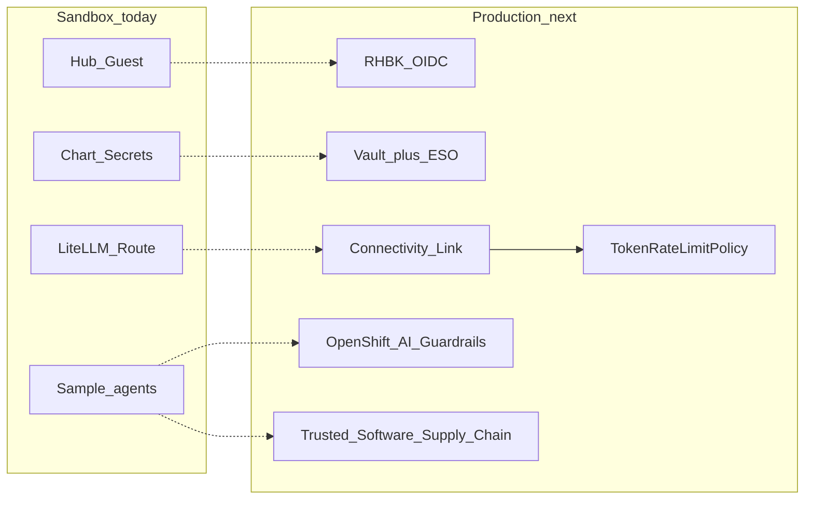

# Production considerations

> **Sandbox demo vs production**
>
> This umbrella chart targets **OpenShift Developer Sandbox**: Guest Hub login, chart-generated Secrets, shared Granite/Qwen via LiteLLM, and optional OpenClaw. The products below are **enterprise recommendations** when you move the same agentic RHDH pattern to a managed OpenShift cluster. They are **not** installed by this Helm chart.

Use this page as a short map from “what works in Sandbox” to “what to add for production identity, secrets, gateway control, AI safety, and CI/CD”.

## At a glance

| Capability | Replaces / hardens in this demo | Primary product |
|---|---|---|
| Identity | Hub Guest + static `mcp-token` | Red Hat build of Keycloak |
| Secrets | Literals in `rhdh-agent-sandbox-secrets` | Vault + External Secrets Operator |
| North–south API control | Open Routes to LiteLLM / Hub | Red Hat Connectivity Link |
| Fair / cost-aware LLM use | No token quotas | `TokenRateLimitPolicy` |
| Prompt / response safety | No content detectors | OpenShift AI Guardrails (TrustyAI) |
| Agent image / template CI/CD | Manual / ad-hoc builds | Trusted Software Supply Chain (RHADS-SSC) |

---

## 1. Red Hat Connectivity Link

**Why:** Put Gateway API policies in front of LiteLLM, Hub APIs, and agent HTTP endpoints so auth, routing, and rate limits are enforced outside the pods.

**Vs Sandbox today:** LiteLLM and Hub are exposed with OpenShift Routes and chart secrets; there is no AuthPolicy / GatewayPolicy layer.

**Learn more:**

- [Red Hat Connectivity Link documentation](https://docs.redhat.com/en/documentation/red_hat_connectivity_link/)
- [Configuring and deploying gateway policies](https://docs.redhat.com/en/documentation/red_hat_connectivity_link/1.3/html/configuring_and_deploying_gateway_policies/rhcl-config-deploy-gateway-policies) (AuthPolicy, RateLimitPolicy, DNSPolicy)

---

## 2. TokenRateLimitPolicy (controlled agent usage)

**Why:** LLM cost tracks **tokens**, not request count. `TokenRateLimitPolicy` extracts OpenAI-style `usage.total_tokens` and enforces per-user or per-group budgets (for example free vs pro), returning HTTP 429 when limits are exceeded. Pair with Connectivity Link `AuthPolicy` so identity drives the limit.

**Vs Sandbox today:** Shared models and LiteMaaS have no chart-managed token budget; a noisy agent can consume quota freely.

**Learn more:**

- [Configure token-based rate limiting with TokenRateLimitPolicy](https://docs.redhat.com/en/documentation/red_hat_connectivity_link/1.2/html/configuring_and_deploying_gateway_policies/proc-configure-token-based-rate-limiting_rhcl)
- [Manage AI resource use with TokenRateLimitPolicy](https://developers.redhat.com/articles/2026/02/18/manage-ai-resource-use-tokenratelimitpolicy) (Red Hat Developer)

---

## 3. Red Hat build of Keycloak (RHBK)

**Why:** Replace anonymous Guest (and long-lived static MCP tokens) with enterprise OIDC: realms, groups, MFA, and short-lived tokens for Hub, Lightspeed, and gateway AuthPolicy.

**Vs Sandbox today:** Hub Guest for demos; `mcp-token` / `litellm-master-key` are chart-generated Secrets.

**Learn more:**

- [Red Hat build of Keycloak documentation](https://docs.redhat.com/en/documentation/red_hat_build_of_keycloak/)
- [RHBK Operator guide](https://docs.redhat.com/en/documentation/red_hat_build_of_keycloak/26.6/html/operator_guide/installation-)
- [Server Administration Guide — features and concepts](https://docs.redhat.com/en/documentation/red_hat_build_of_keycloak/26.4/html/server_administration_guide/red_hat_build_of_keycloak_features_and_concepts)

---

## 4. Vault + External Secrets Operator

**Why:** Keep `litellm-master-key`, `mcp-token`, LiteMaaS / model keys, and agent credentials in a vault (for example HashiCorp Vault). Sync them into Kubernetes with **External Secrets Operator for Red Hat OpenShift** so pods never depend on Helm `--set` secrets or unrotated literals.

**Vs Sandbox today:** Secrets are created/preserved by the chart; rotation of `model-api-key` is a manual `oc whoami -t` patch.

**Learn more:**

- [External Secrets Operator for Red Hat OpenShift](https://docs.redhat.com/en/documentation/openshift_container_platform/4.19/html/security_and_compliance/external-secrets-operator-for-red-hat-openshift) (providers include HashiCorp Vault, cloud secret managers)
- [HashiCorp Vault documentation](https://developer.hashicorp.com/vault/docs)

---

## 5. OpenShift AI Guardrails (AI safety)

**Why:** Run detectors on LLM **inputs and outputs** (PII, hate/profanity, prompt injection, custom rules) via TrustyAI-managed Guardrails Orchestrator / FMS Guardrails — in front of or beside the same LiteLLM / model path agents use.

**Vs Sandbox today:** Lightspeed, Continue, sample agents, and OpenClaw call models with no content-safety orchestrator in this chart.

**Learn more:**

- [Ensuring AI safety with guardrails](https://docs.redhat.com/en/documentation/red_hat_openshift_ai_self-managed/3.4/html-single/enabling_ai_safety_with_guardrails/index) (OpenShift AI Self-Managed)
- [Using FMS Guardrails for AI safety](https://docs.redhat.com/en/documentation/red_hat_openshift_ai_self-managed/3.5/html/enabling_ai_safety_with_guardrails/using-guardrails-for-ai-safety_safety)

---

## 6. Trusted Software Supply Chain (CI/CD for agents)

**Why:** Treat agent images, scaffolder skeletons, and MCP sidecars like any production workload: signed builds, SBOM, CVE scan, and policy gates before they land in the cluster. Red Hat’s portfolio (productized as **Red Hat Advanced Developer Suite — software supply chain**, formerly Trusted Application Pipeline / Trusted Software Supply Chain) combines Developer Hub templates with Pipelines, Quay, Trusted Artifact Signer, Profile Analyzer, and ACS.

**Vs Sandbox today:** Sample agents are chart ConfigMap stubs; Golden Paths deploy without a signed supply-chain pipeline.

**Learn more:**

- [Understanding RHADS — software supply chain](https://docs.redhat.com/en/documentation/red_hat_advanced_developer_suite_-_software_supply_chain/1.9/html-single/understanding_red_hat_advanced_developer_suite_-_software_supply_chain/index)
- [Red Hat Trusted Software Supply Chain (product overview)](https://developers.redhat.com/products/trusted-software-supply-chain)
- Related building blocks: [OpenShift Pipelines](https://docs.redhat.com/en/documentation/red_hat_openshift_pipelines/), [Red Hat Quay](https://docs.redhat.com/en/documentation/red_hat_quay/)

---

## Suggested adoption order

1. **RHBK + Vault/ESO** — stop Guest-only and secret sprawl.  
2. **Connectivity Link + TokenRateLimitPolicy** — protect LiteLLM / agent Routes and budget tokens.  
3. **Guardrails** — safety on the inference path.  
4. **Trusted Software Supply Chain** — harden how agent artifacts are built and promoted.

## Related

- [Architecture]({{ '/architecture/' | relative_url }}) — what this chart deploys today  
- [Lightspeed & models]({{ '/lightspeed-models/' | relative_url }}) — Sandbox model aliases and LiteMaaS  
- [AI capabilities]({{ '/ai-capabilities/' | relative_url }}) — Hub / MCP / agents surface  
- [Troubleshooting]({{ '/troubleshooting/' | relative_url }}) — Sandbox-specific failures  
